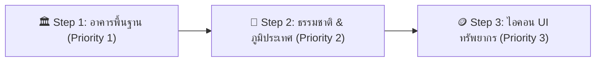

---
tags:
  - gdd
  - assets
  - guide
  - step-by-step
version: "1.0"
created: 2026-08-19
last_updated: 2026-08-19
agent_in_charge: "[[Agent_Marshmallow]]"
---

# 🎨 คู่มือสร้าง Asset เกมแบบ Step-by-Step — Project Kingdom

> คู่มือนี้จัดทำขึ้นเพื่อให้คุณสร้างรูปภาพประกอบเกมได้อย่างรวดเร็ว ถูกต้องตามสเปก และเข้ากันได้กับตัวเกม 100%

---

## 🧭 Roadmap ขั้นตอนการสร้าง (ทำทีละ Step)



---

## 🏛️ STEP 1: สิ่งก่อสร้างพื้นฐาน 6 หลัง (เริ่มที่อันนี้ก่อน!)

### 📁 ที่อยู่ไฟล์ที่ต้องนำไปวางเมื่อสร้างเสร็จ:
```text
G:\ไดรฟ์ของฉัน\SecondBrain\Second Brain\04_PROJECTS\Kingdom\Assets\Building\Standard_Buildings_Sheet.png
```

### 📐 รายละเอียดอาคาร 6 หลังในแผ่นเดียว:
1. **🏠 House (บ้านพัก):** กระท่อมไม้/หินหลังคาสีส้มอิฐหรือกระเบื้องไม้ มีประตูและหน้าต่างเล็กๆ
2. **🌾 Farm (ฟาร์มเกษตร):** แปลงดินพรวน มีรวงข้าวสาลีสีทองสุกอร่าม มีรั้วไม้เตี้ยๆ ล้อม
3. **🪚 Lumber Mill (โรงเลื่อยไม้):** เพิงไม้เปิดโล่ง มีกองท่อนซุงเรียงราย และขวานปักบนตอไม้
4. **⛏️ Mine (เหมืองแร่):** ปากอุโมงค์เหมืองหิน มีคานไม้ค้ำยัน และรางรถเข็นบรรทุกก้อนหิน/เหล็ก
5. **⚔️ Barracks (ค่ายทหาร):** อาคารหินผสมไม้ มีหุ่นฟางสำหรับซ้อมดาบ และเสาธงปักด้านหน้า
6. **🗼 Watchtower (หอสังเกตการณ์):** หอยามไม้หรือหินทรงสูง มีชานพักและคบเพลิงด้านบน

### 📋 คำสั่ง Prompt ภาษาอังกฤษ (Copy ไปวางใน AI Generator ได้ทันที):
```text
16-bit pixel art, top-down RPG medieval fantasy building sprite sheet, 
including 6 distinct structures arranged in a neat grid:
1. Small cozy wooden cottage house with warm tiled roof
2. Farmland soil patch with golden wheat crops and small wooden fence
3. Lumber mill sawmill shed with stacked timber logs and chopping block
4. Stone mine cave entrance with wooden support beams and ore cart
5. Military barracks training outpost with target dummy and faction flag
6. Tall stone and timber watchtower guard post with torch

Isolated on solid dark grey background (#2a2a2a), clean pixel clusters, 
sharp pixel art style matching Kingdom Builder 16-bit aesthetic, 
consistent 3/4 top-down angle, no anti-aliasing blur.
```

---

## 🌲 STEP 2: ธรรมชาติและภูมิประเทศ (Nature & Props)

### 📁 ที่อยู่ไฟล์:
```text
G:\ไดรฟ์ของฉัน\SecondBrain\Second Brain\04_PROJECTS\Kingdom\Assets\Environment\Nature_Props_Sheet.png
```

### 📋 คำสั่ง Prompt ภาษาอังกฤษ:
```text
16-bit pixel art environment props sheet, top-down medieval RPG style, 
isolated on dark neutral background:
- 2 variants of lush green oak trees
- 1 snowy pine tree
- 1 mossy fallen tree log
- 2 variants of grey mountain rocks and boulders
- 1 glowing blue/silver iron ore crystal rock deposit
- 1 clean stone road tile texture

Clean pixel clusters, vibrant colors, matching 16-bit kingdom builder game style.
```

---

## 🪙 STEP 3: ไอคอนทรัพยากรบน HUD (UI Icons 24x24)

### 📁 ที่อยู่ไฟล์:
```text
G:\ไดรฟ์ของฉัน\SecondBrain\Second Brain\04_PROJECTS\Kingdom\Assets\UI\Resource_Icons.png
```

### 📋 คำสั่ง Prompt ภาษาอังกฤษ:
```text
16-bit pixel art fantasy game UI icon set, 24x24 pixel scale, neat row of 5 icons:
1. Shining gold coins overflowing from leather pouch (Gold)
2. Sheaf of golden ripe wheat and bread (Food)
3. Stack of three chopped brown wooden logs (Wood)
4. Squared carved granite stone block (Stone)
5. Refined gleaming steel iron ingot bar (Iron)

High contrast, crisp pixel outline, isolated on dark neutral background.
```

---

## 🔗 ลิงก์ที่เกี่ยวข้อง
- หน้ารวม Asset ทั้งหมด: [[18-Asset-Gallery]]
- หน้าควบคุมโปรเจกต์: [[Project_Kingdom_Master_Hub]]
- คลังคำสั่ง Prompt ทั้งหมด: [[16-Art-Asset-Prompts]]
